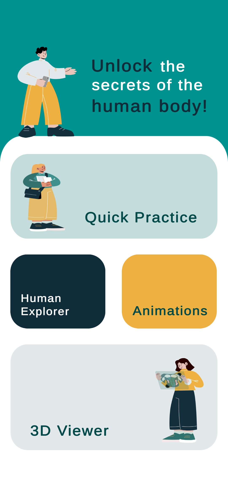
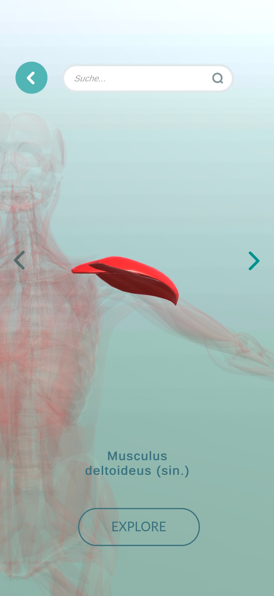
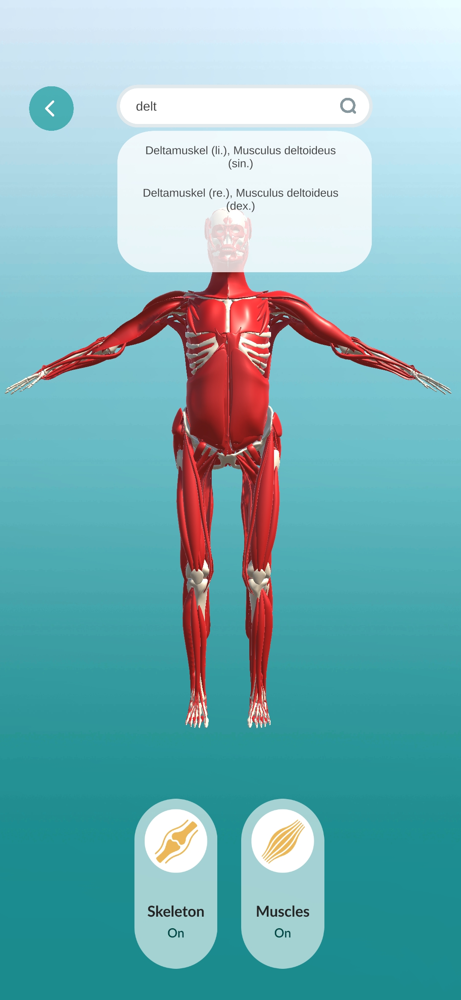
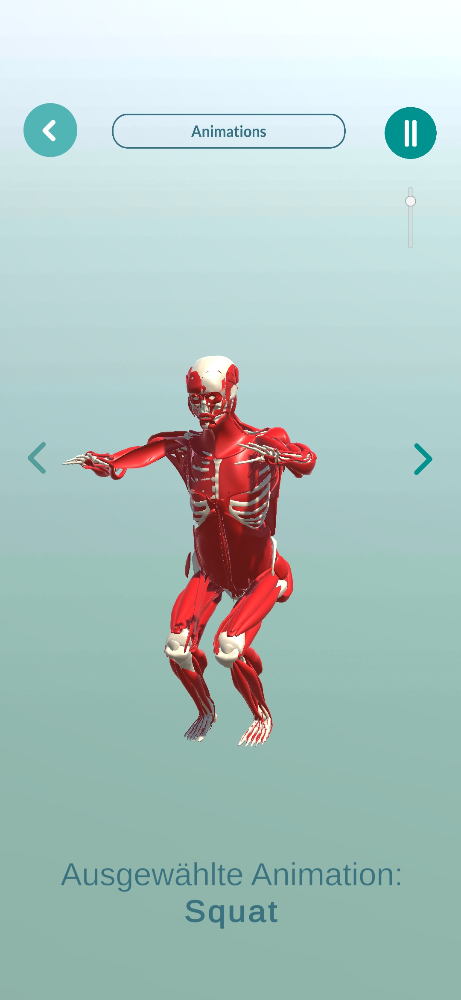
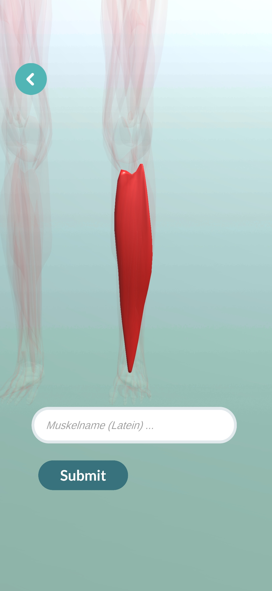
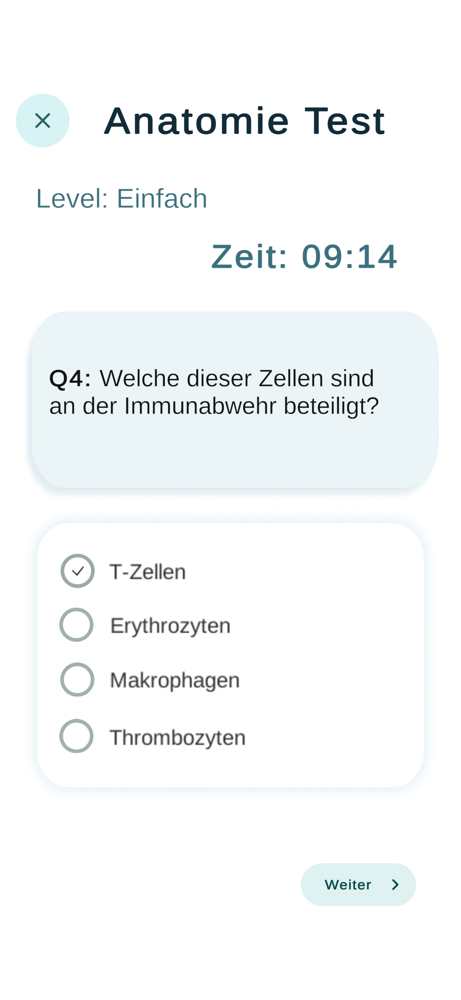
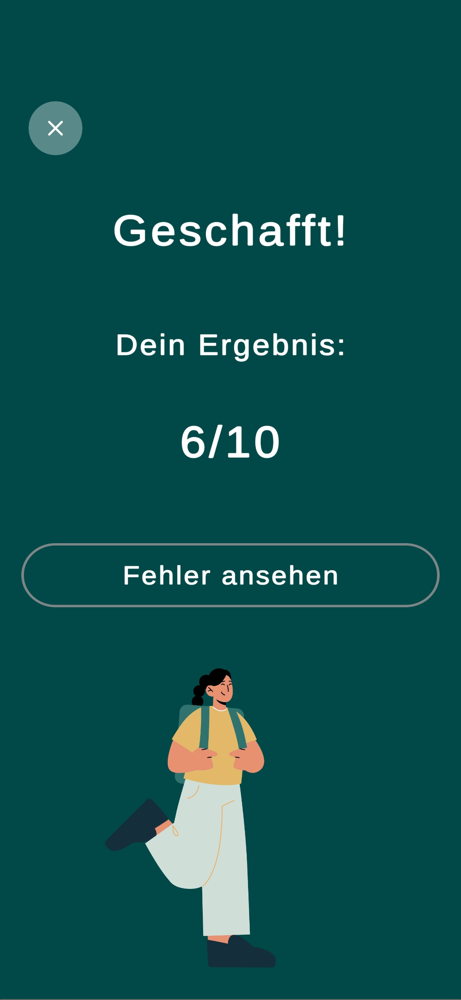
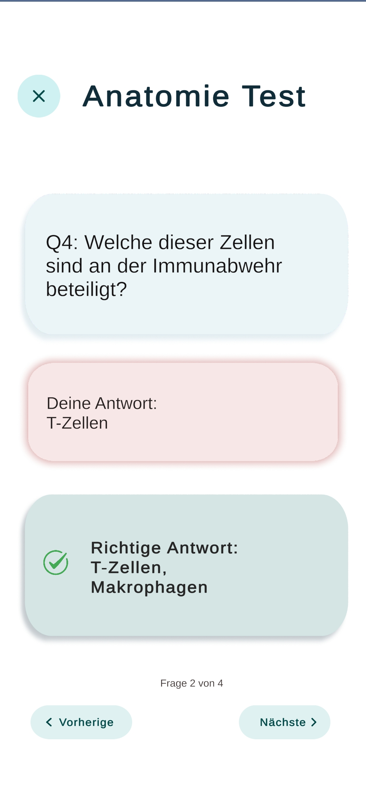

# AnatoLearn

AnatoLearn is an interactive anatomy learning app built in Unity that allows users to explore 3D models of the human body and learn about various anatomical structures and functions.

## Features

- **Human Explorer** – View muscle names, descriptions, and their locations on the human body.
- **Animations** – Explore anatomical animations on the interactive 3D human model.
- **3D Viewer** – Freely explore the 3D human model and toggle muscle and bone layers.
- **Quick Practice** – Test your knowledge with a muscle quiz and anatomy test.

## Screenshots

  
  
  
  

  
  
  
  

